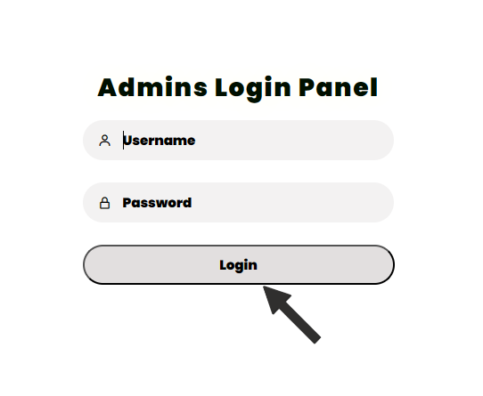
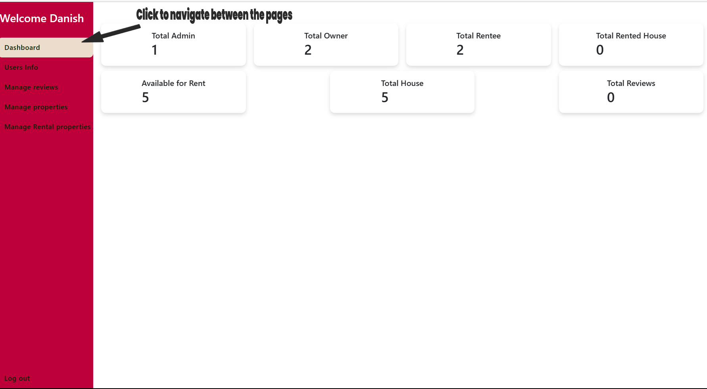
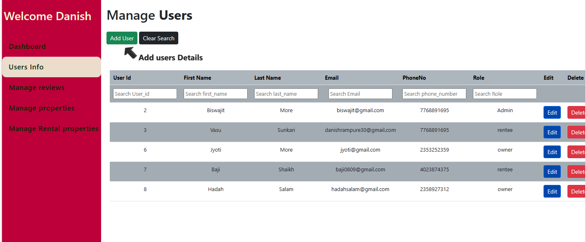
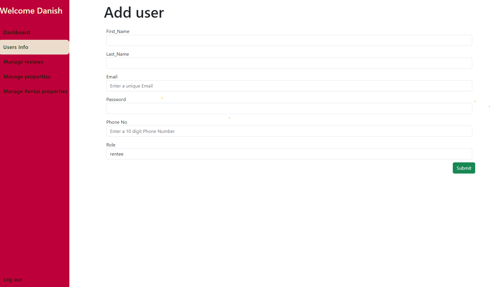
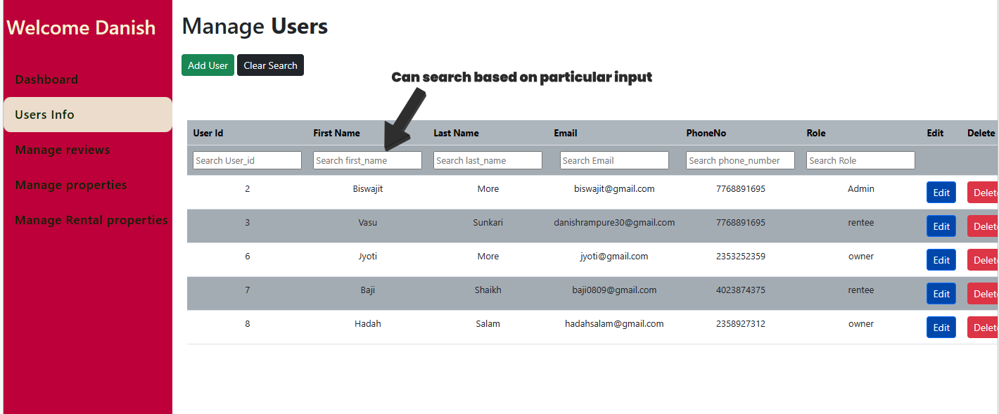
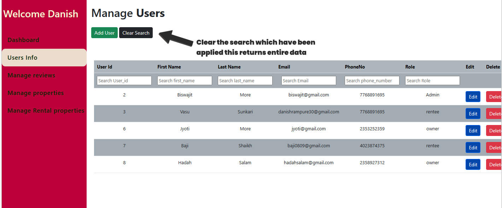
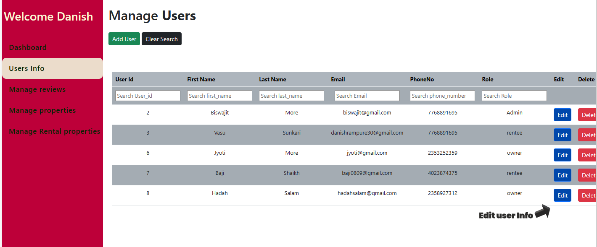
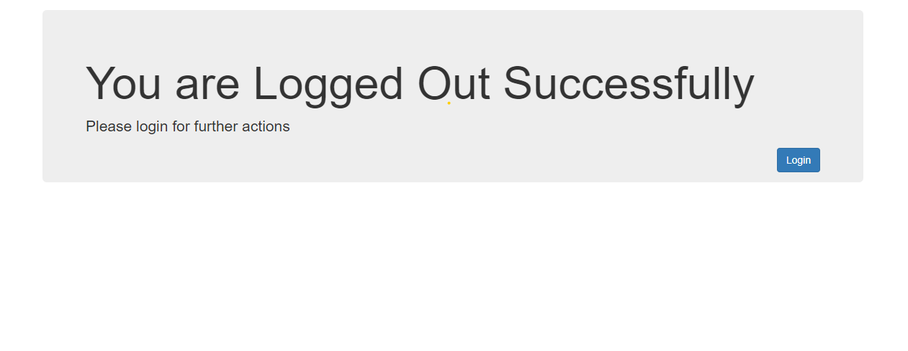

# Steps for Navigating and browsing around the AdminPanel Pannel of House Rental WebApp


## `Steps for Coders`


 >`Step1:`
  * In order to Start the app first clone the WebApplication
```
git clone 'branchname'
```

[In order to read more about cloning click](https://github.com/git-guides/git-clone "Github Cloning Commands")


---
  >`Step2:`
  * Install Sql Workbench else if it is present in your system open the database and create a database overalldb 
  * Go to the location folder where your manage.py file is present
    * In order to create relevant models inside the database open the code in VsCode and open the terminal and type the below commands
```
python manage.py makemigrations
```
```
python manage.py migrate
```

---
>Step3:
 * Know you are good to run the app in any server where it is locate
  * In order to run the project on Server
  type the below commands

```
python manage.py runserver
```  
* If you want to specify the port number than you can type the following commands
```
python manage.py runserver 
```  
[To know more about sql and installation and creating database click ]("http://webvaultwiki.com.au/Default.aspx?Page=Create-Mysql-Database-User-Workbench&NS=&AspxAutoDetectCookieSupport=1") 

 >`Page Wise NAvigation Overview:`
  * In order to ope the adminpanel you have to redirect at 
```
http://127.0.0.1:8000/adminpanel/
```

 >`First Page:`
  * Once you land to Adminpanel which maanges the properties of RenteeUsers,OwnerUsers,AdminUsers,Reviews,Property to be rented,and rented property 
    
    * Login with the credentials provided by adminteam 
    * Enter Credentials
```
UserName:
Password
```



 >`Step6:`
  * Once you enterd right credentials you will see the following page
    * Here you will see the total information of Total number of property and Users


 
 > ### `UserInfo Description:`
  * Navigating to UserInfo yo can browse many functionality which are displayed below
   * IN order to Add On any User with its Detail Click on the Add User



 >`AddUser:`
  * To Add The UserDetails you have displayed Below Fields
   * On Adding User click on the Submit Button to save the changes Successfully



 >`SearchButtonNavigation:`
  * As the data submitted by people will be numerous in number so we have implemented search option in order to filter the required document where on clicking the input button type the information you needed and will get the details


 >`ClearSearch:`
  * Once the admin is done with viewing the searched info and he want to see entire data again for that we hav introduced clear search
    * Clear Option will be available for every page in adminpanel with same functioning


 >`Edit Option:`
  * This option edit is available for the admin where admin can modify the data which is available with respect to given fields

 >`Delete Option:`
  * This option delete is available for the admin where admin can delete the data which is available the entire data


  >`Optionwise Search:`
  * This option wise search is available for the admin where admin can search the data which is suggested in the form of options which provides ease to user
  * The option is applicalable for similar data field
  
  >`Logout:`
  * This clicking the option logout you will be redirected to the below page
     * Where if you wish to relogin you can click the Login Button Available .This will again redirect to first page of adminpanel which is login
